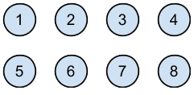
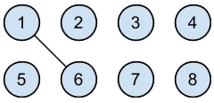
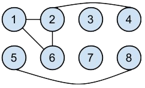

# MyTest

Simple solution granted for:

### Problem:

We have a set of elements. In this example I will use eight.

We can make a set of connections. For example we can connect 1 to 6.

We can make any number of connections and any two elements can be connected. Let’s make the following connections: 1-2, 6-2, 2-4, 5-8

Now we need to be able to determine if two elements are connected, either directly or through a series of connections. 1 and 6 are connected, as are 6 and 4. But 7 and 4 are not connected, neither are 5 and 6. We do not care about the path, 1 and 2 are connected both directly and also through 6, but for this problem the fact that there are two paths is irrelevant.

### Task:

Write a class Network. The constructor should take a positive integer value indicating the number of elements in the set. Passing in an invalid value should throw an exception. The class should also provide two public methods, connect and query. The first method, connect will take two integers indicating the elements to connect. This method should throw exceptions as appropriate. The second method, query will also take two integers and should also throw an exception as appropriate. It should return true if the elements are connected, directly or indirectly, and false if the elements are not connected. The class can have as many private or protected members as needed for a good implementation.
